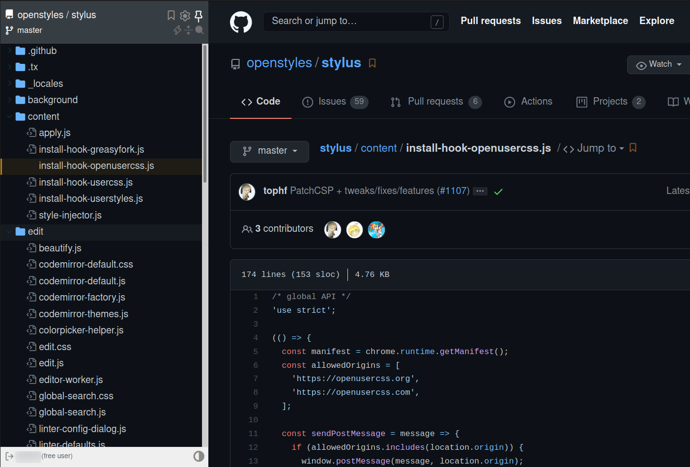

## Octotree free dark theme

Did you want a free dark theme for your  addon? Here's one for you, and it even matches the new gihtub dark mode :tada:  

## How to install
* install  (or similar)
* add custom style file and set the domain to `github.com`
* copy and paste the `githubOctotreeDark.css` code 
* enjoy 🕶

## How it looks

